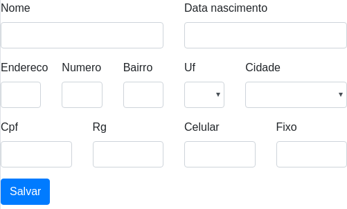

# Laravel HTML (Em desenvolvimento)

# Problema
Perda de tempo com edição HTML pré-definida.

# Contexto
Para escrita do HTML devem ser criados arquivos _views_, o problema é que isso 
causa reescrita de HTML pré-definido, marcação geralmente já está definida pelos _Frameworks CSS_ 
cujas futuras mudanças no padrão do HTML devem ser alteradas em cada arquivo 
_view_ aumentando assim o grau de dificuldade na manutenção pois a marcação HTML 
torna o conteúdo do arquivo grande e menos legível do que usar uma padrão para 
abstração de métodos para geração do HTML.

# Solução
Criar conjunto de classes PHP para gerar HTML pré-definido passando apenas 
parâmetros necessários para geração dinâmica.

# Plugins recebendo plugins
É padrão utilizar `add` antes do nome do plugin para adicioná-lo a outro.
```php
$form = $screen->addForm('/');
$form->addText('apelido');
```
> O exemplo acima adiciona o plugin `text` ao plugin `form`.

# Escopo
É responsabilidade desta biblioteca abstrair a logica de geração de **grids responsivas**
 e gerar HTML de acordo com o **provider** escolhido.
>>>
*  **Grids responsivas**: lógica utilizada pelos frameworks CSS que definem linhas
 e colunas para organizar conteúdo em diferentes tamanhos de tela.
*  **Provider**: seletor do grupo que define os templates HTML
>>>

# Exemplos
*  Declarando elementos em PHP $1862748
*  Saida HTML $1862749


