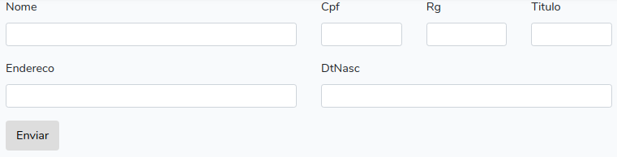

# Laravel HTML (Em desenvolvimento)
Abstração do sistema de **grid responsiva** dos _frameworks CSS_ e seus **templates**.

## Classe LaraHtml
```php
$form = $this->addForm('/'); // ADD FORM
$colNome = $form->addText('nome')->getCol(); // STORE COLUMN OF FIELD NOME
$colNome->row(); // NEW ROW
$colNome->addText('endereco'); // ADD FIELD IN COLUMN OF NOME
$colCpf = $form->addText('cpf')->getCol(); // STORE COLUMN OF FIELD CPF
$colCpf->addText('rg');
$colCpf->addText('titulo');
$colCpf->row();
$colCpf->addText('dtNasc');
$form->row(); // NEW ROW IN FORM
$form->addButton('Enviar');
```

## Browser


## Saída HTML
```html
<div class="container-fluid">
    <div class="row">
        <div class="col-md-12">
            <form action="/">
                <div class="row">
                    <div class="col-md-6">
                        <div class="row">
                            <div class="col-md-12">
                                <div class="form-group">
                                    <label>Nome</label> 
                                    <input name="nome"class="form-control form-control-sm">
                                </div>
                            </div>
                        </div>
                        <div class="row">
                            <div class="col-md-12">
                                <div class="form-group">
                                    <label>Endereco</label> 
                                    <input name="endereco" class="form-control form-control-sm">
                                </div>
                            </div>
                        </div>
                    </div>
                    <div class="col-md-6">
                        <div class="row">
                            <div class="col-md-4">
                                <div class="form-group">
                                    <label>Cpf</label> 
                                    <input name="cpf" class="form-control form-control-sm">
                                </div>
                            </div>
                            <div class="col-md-4">
                                <div class="form-group">
                                    <label>Rg</label> 
                                    <input name="rg" class="form-control form-control-sm">
                                </div>
                            </div>
                            <div class="col-md-4">
                                <div class="form-group">
                                    <label>Titulo</label> 
                                    <input name="titulo" class="form-control form-control-sm">
                                </div>
                            </div>
                        </div>
                        <div class="row">
                            <div class="col-md-12">
                                <div class="form-group">
                                    <label>DtNasc</label> 
                                    <input name="dtNasc" class="form-control form-control-sm">
                                </div>
                            </div>
                        </div>
                    </div>
                </div>
                <div class="row">
                    <div class="col-md-12">
                        <button class="btn">Enviar</button>
                    </div>
                </div>
            </form>
        </div>
    </div>
</div>
```

# Instalação
```bash
composer require moreiraandre/lara-html
```

## Exportando configuração
```bash
php artisan vendor:publish --tag=lhtmlcfg
```

## Exportando views blade
_Necessário somente se você quiser customizar algum template ou criar o seu próprio._
```bash
php artisan vendor:publish --tag=lhtmltpl
```

## Criando classe de tela
```bash
php artisan make:lhtml PersonForm
```
> As classes de _telas_ serão criadas no diretório _app/Screens_.

## Gerando o HTML
```php
// No seu controller.

public function create()
{
    return lhtml(new App\PersonForm);
    
    // PASSANDO DADOS PARA A CLASSE
    // return lhtml(new App\PersonForm($data));
}
```
> O helper `lhtml` retorna o HTML da classe de tela.

> Na sua view de template é necessário chamar `yield('html')` onde você quer que o HTML seja exibido. 

## Definindo atributos de tag
```php
$colNome->attrClass('input-mask'); // CONCATENA COM O VALOR DA CONFIGURAÇÃO
$colNome->attrClass = 'input-mask'; // SUBSTITUI O VALOR DA CONFIGURAÇÃO
```
> O prefixo `attr` indica a definição de atributos, o atributo deve ser escrito no padrão _StudlyCase_.

# Desenvolvimento
### André Moreira 
  Projetista e desenvolvedor
  * andre.mcx1+lara-html@gmail.com
  * https://github.com/moreiraandre

### Tom Benevides
 Gestor da documentação  
  * eltonfelixbenevides+lara-html@gmail.com
  * https://github.com/tomfbenevides
